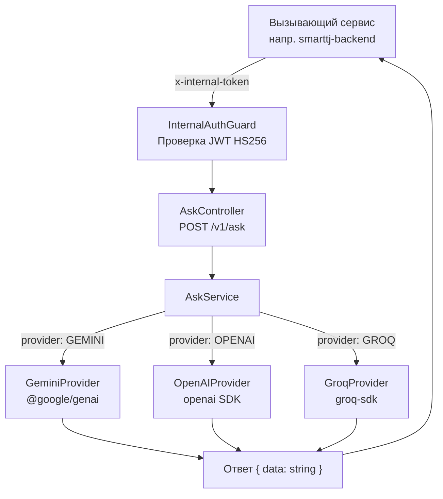

# 🤖 SmartTJ AI Service (`smarttj-ai`)

<p align="left">
  
  
  
  
  
  
</p>

Внутренний микросервис генеративного искусственного интеллекта для экосистемы **SmartTJ**. Служит единым защищенным шлюзом для взаимодействия других бэкенд-сервисов платформы с современными большими языковыми моделями (LLM).

---

## 📋 Содержание

- [Обзор и возможности](#-обзор-и-возможности)
- [Технологический стек](#-технологический-стек)
- [Архитектура сервиса](#-архитектура-сервиса)
- [Структура проекта](#-структура-проекта)
- [Переменные окружения](#-переменные-окружения)
- [Безопасность и межсервисная аутентификация](#-безопасность-и-межсервисная-аутентификация)
- [API Документация](#-api-документация)
  - [Эндпоинт POST /v1/ask](#post-v1ask)
  - [Примеры вызовов](#примеры-вызовов-curl)
- [Логирование](#-логирование)
- [Установка и локальный запуск](#-установка-и-локальный-запуск)
- [Docker и развертывание](#-docker-и-развертывание)
- [CI/CD](#-cicd)
- [Команды разработки и тестирования](#-команды-разработки-и-тестирования)

---

## 🚀 Обзор и возможности

- **Мульти-провайдерная поддержка LLM**:
  - **Google Gemini**: официальный SDK `@google/genai` (дефолтная модель: `gemini-3-flash-preview` / `gemini-2.5-flash`).
  - **OpenAI**: официальный SDK `openai` (дефолтная модель: `gpt-5.1` / `gpt-4o`).
  - **Groq**: сверхбыстрый инференс с открытыми моделями через `groq-sdk` (дефолтная модель: `openai/gpt-oss-20b` / `llama-3.3-70b-versatile`).
- **Сценарии использования (`AskRequestPurpose`)**:
  - `SUPPORT` — ответы на вопросы пользователей, автоматизация саппорта.
  - `ANALYTICS` — анализ транзакций, генерация сводок и бизнес-аналитика.
  - `PRODUCT_MODERATE` — автоматическая модерация товаров (проверка на спам, контрафакт, мошенничество).
- **Межсервисная безопасность**:
  - Защита внутренних эндпоинтов с помощью `InternalAuthGuard`.
  - Валидация подписи JWT (HS256), времени жизни (`exp`), сервиса-отправителя (`iss`) и сервиса-получателя (`aud`).
- **Продвинутая система логирования**:
  - Цветной вывод в консоль в формате NestJS с контекстом класса.
  - Автоматическая ротация файлов через Winston Daily Rotate (`combined` — 14 дней, `error` — 30 дней) в сжатых архивах `.gz`.
- **Быстрый современный рантайм**:
  - Работа на **Bun** в качестве рантайма и пакетного менеджера.
  - Строгая типизация TypeScript (ESM-модули).

---

## 🛠 Технологический стек

| Категория                     | Технология                                                       |
| :---------------------------- | :--------------------------------------------------------------- |
| **Runtime & Package Manager** | [Bun](https://bun.sh/) (v1.x)                                    |
| **Фреймворк**                 | [NestJS](https://nestjs.com/) (v12.x)                            |
| **Язык**                      | [TypeScript](https://www.typescriptlang.org/) (v6.x, ESM)        |
| **AI Интеграции**             | `@google/genai`, `openai`, `groq-sdk`                            |
| **Межсервисная безопасность** | `jsonwebtoken` (HS256)                                           |
| **Общие типы/контракты**      | `@smarttj/core`                                                  |
| **Логирование**               | `winston`, `winston-daily-rotate-file`, `nest-winston`           |
| **Тестирование**              | [Vitest](https://vitest.dev/) (Unit & E2E), Supertest            |
| **Линтер и форматирование**   | [oxlint](https://oxc.rs/), [Prettier](https://prettier.io/)      |
| **Контейнеризация**           | Multi-stage Docker (на базе `oven/bun:1-alpine`), Docker Compose |

---

## 🏗 Архитектура сервиса

Входящий запрос от смежного сервиса (например, `smarttj-backend`) проходит через глобальный префикс `/v1`, проверяется гардом межсервисной безопасности и направляется в провайдер выбранной LLM:



---

## 📂 Структура проекта

```text
smarttj-ai/
├── .github/
│   └── workflows/
│       └── deploy.yml              # CI/CD автоматический деплой на VPS
├── src/
│   ├── common/
│   │   ├── decorators/
│   │   │   └── caller.decorator.ts # Декоратор @CallerService() для извлечения iss
│   │   └── guards/
│   │       └── internal-auth.guard.ts # Проверка x-internal-token (JWT HS256)
│   ├── logger/
│   │   ├── logger.config.ts        # Конфигурация Winston (ротация combined и error логов)
│   │   ├── logger.module.ts        # Глобальный NestJS модуль логирования
│   │   └── logger.service.ts       # NestJS LoggerService с цветным выводом
│   ├── modules/
│   │   └── ask/
│   │       ├── ask.controller.ts   # POST /v1/ask контроллер
│   │       ├── ask.module.ts       # Модуль вопросов к LLM
│   │       └── ask.service.ts      # Роутинг промптов между провайдерами
│   ├── providers/
│   │   ├── gemini.provider.ts      # Интеграция с Google Gemini
│   │   ├── groq.provider.ts        # Интеграция с Groq
│   │   └── openai.provider.ts      # Интеграция с OpenAI
│   ├── app.module.ts               # Корневой модуль приложения
│   └── main.ts                     # Точка входа приложения (порт, CORS, префикс /v1)
├── test/
│   └── app.e2e-spec.ts             # E2E тесты
├── Dockerfile                      # Multi-stage сборка на базе oven/bun:1-alpine
├── docker-compose.yml              # Запуск в составе сети smarttj-network
├── .env.example                    # Пример конфигурации переменных окружения
├── package.json
├── tsconfig.json
└── vitest.config.ts                # Конфигурация Vitest
```

---

## ⚙️ Переменные окружения

Создайте файл `.env` в корне проекта на основе `.env.example`:

```bash
cp .env.example .env
```

| Переменная                | Описание                                            | Обязательна | Значение по умолчанию    | Пример                        |
| :------------------------ | :-------------------------------------------------- | :---------: | :----------------------- | :---------------------------- |
| `PORT`                    | Порт HTTP-сервера                                   |     Нет     | `3000`                   | `3000`                        |
| `SERVICE_NAME`            | Идентификатор текущего сервиса (для `aud` в JWT)    |   **Да**    | —                        | `smarttj-ai`                  |
| `INTERNAL_SERVICE_SECRET` | Секретный ключ для подписи межсервисных JWT (HS256) |   **Да**    | —                        | `your-strong-internal-secret` |
| `GEMINI_API_KEY`          | Ключ Google Gemini API                              |     Да*     | —                        | `AIzaSy...`                   |
| `GEMINI_DEFAULT_MODEL`    | Модель Gemini по умолчанию                          |     Нет     | `gemini-3-flash-preview` | `gemini-2.5-flash`            |
| `OPENAI_API_KEY`          | Ключ OpenAI API                                     |     Да*     | —                        | `sk-...`                      |
| `OPENAI_DEFAULT_MODEL`    | Модель OpenAI по умолчанию                          |     Нет     | `gpt-5.1`                | `gpt-4o`                      |
| `GROQ_API_KEY`            | Ключ Groq API                                       |     Да*     | —                        | `gsk_...`                     |
| `GROQ_DEFAULT_MODEL`      | Модель Groq по умолчанию                            |     Нет     | `groq/compound`          | `llama-3.3-70b-versatile`     |

_\* Требуется ключ провайдера, если через него отправляются запросы._

---

## 🔐 Безопасность и межсервисная аутентификация

Все запросы к сервису защищены гардом `InternalAuthGuard`. Доступ разрешён только доверенным сервисам платформы SmartTJ.

### Механизм проверки токена

1. Клиент передает заголовок: `x-internal-token: <JWT>`.
2. Токен верифицируется алгоритмом `HS256` с использованием секрета `INTERNAL_SERVICE_SECRET`.
3. Поле `aud` (audience) в токене должно **строго совпадать** с `SERVICE_NAME` (`smarttj-ai`). Иначе возвращается `403 Forbidden`.
4. Имя вызывающего сервиса берется из поля `iss` (issuer) и доступно в контроллерах через декоратор `@CallerService()`.

### Пример генерации токена в вызывающем сервисе (TypeScript)

```typescript
import jwt from 'jsonwebtoken';

const token = jwt.sign(
  {
    iss: 'smarttj-backend', // Имя вызывающего сервиса
    aud: 'smarttj-ai', // Имя целевого сервиса
  },
  process.env.INTERNAL_SERVICE_SECRET!,
  {
    algorithm: 'HS256',
    expiresIn: '5m', // Короткий срок жизни токена
  },
);
```

---

## 📡 API Документация

Глобальный базовый URL: `http://<host>:<port>/v1`

### `POST /v1/ask`

Отправка промпта в одну из языковых моделей.

#### Заголовки (Headers)

| Заголовок          | Тип      | Описание                            | Обязательный |
| :----------------- | :------- | :---------------------------------- | :----------: |
| `Content-Type`     | `string` | `application/json`                  |      Да      |
| `x-internal-token` | `string` | Внутренний JWT токен аутентификации |    **Да**    |

#### Тело запроса (Request Body)

```typescript
interface AskRequest {
  purpose: 'SUPPORT' | 'ANALYTICS' | 'PRODUCT_MODERATE'; // Цель запроса
  prompt: string; // Текст запроса к ИИ
  context?: string; // Системный промпт / контекст (опционально)
  model?: string; // Конкретная модель (опционально)
  temperature?: number; // Температура (по умолчанию 0.3)
  provider?: 'OPENAI' | 'GEMINI' | 'GROQ'; // Провайдер (по умолчанию GEMINI)
}
```

#### Ответы (Responses)

##### Успешный ответ (`200 OK`)

```json
{
  "data": "Ответ модели в текстовом виде (или JSON-строка, если запрашивалась модерация)"
}
```

##### Ошибки

- **`401 Unauthorized`**: Отсутствует или недействителен заголовок `x-internal-token`.
  ```json
  {
    "message": "Отсутствует заголовок x-internal-token",
    "error": "Unauthorized",
    "statusCode": 401
  }
  ```
- **`403 Forbidden`**: Токен выписан для другого сервиса (`aud` не равен `SERVICE_NAME`).
  ```json
  {
    "message": "Неверный получатель: токен выписан для smarttj-core, а не для smarttj-ai",
    "error": "Forbidden",
    "statusCode": 403
  }
  ```
- **`500 Internal Server Error`**: Ошибка внешнего API (Gemini/OpenAI/Groq).

---

### Примеры вызовов (cURL)

#### 1. Модерация карточки товара через Gemini

```bash
curl -X POST http://localhost:3000/v1/ask \
  -H "Content-Type: application/json" \
  -H "x-internal-token: <ВАШ_ВНУТРЕННИЙ_JWT>" \
  -d '{
    "purpose": "PRODUCT_MODERATE",
    "provider": "GEMINI",
    "context": "Ты модератор интернет-магазина. Проверь входные данные на спам и мошенничество. Формат ответа строго JSON: {\"text\": \"...\", \"ok\": true | false}",
    "prompt": "Название: iPhone 15 Pro Max 1TB. Описание: Продам срочно за 100 сомони, пишите в Telegram @scam",
    "temperature": 0.1
  }'
```

#### 2. Запрос в клиентскую поддержку через OpenAI

```bash
curl -X POST http://localhost:3000/v1/ask \
  -H "Content-Type: application/json" \
  -H "x-internal-token: <ВАШ_ВНУТРЕННИЙ_JWT>" \
  -d '{
    "purpose": "SUPPORT",
    "provider": "OPENAI",
    "context": "Ты вежливый помощник сервиса SmartTJ. Отвечай кратко на таджикском или русском языке.",
    "prompt": "Как отследить статус моего заказа?",
    "temperature": 0.5
  }'
```

#### 3. Быстрая аналитика через Groq

```bash
curl -X POST http://localhost:3000/v1/ask \
  -H "Content-Type: application/json" \
  -H "x-internal-token: <ВАШ_ВНУТРЕННИЙ_JWT>" \
  -d '{
    "purpose": "ANALYTICS",
    "provider": "GROQ",
    "prompt": "Сформируй краткую сводку по продажам за день: 120 заказов, выручка 45 000 TJS, возврат 1 заказ."
  }'
```

---

## 📝 Логирование

Сервис использует собственный `LoggerService` на базе `winston` и `winston-daily-rotate-file`:

- **Консоль**: форматированный вывод с цветовой индикацией уровней (`LOG`, `ERROR`, `WARN`, `DEBUG`, `VERBOSE`), временными метками и PID процесса.
- **Файлы**:
  - `logs/combined-YYYY-MM-DD.log` — все информационные и ошибочные логи (срок хранения: 14 дней, автоархивация в `.gz`).
  - `logs/error-YYYY-MM-DD.log` — только ошибки со стек-трейсами (срок хранения: 30 дней, автоархивация в `.gz`).
- При сбоях запросов к LLM автоматически логируются: имя провайдера, цель запроса (`purpose`), модель и тело ошибки.

---

## 💻 Установка и локальный запуск

### Предварительные требования

- Установленный [Bun](https://bun.sh/) (версия 1.1+)
- Node.js 20+ (опционально, если используется Bun)

### Шаги установки

1. Клонируйте репозиторий:

   ```bash
   git clone <repo-url>
   cd smarttj-ai
   ```

2. Установите зависимости:

   ```bash
   bun install
   ```

3. Настройте конфигурацию:

   ```bash
   cp .env.example .env
   # Укажите API ключи и INTERNAL_SERVICE_SECRET в файле .env
   ```

4. Запустите сервис в режиме разработки:
   ```bash
   bun run start:dev
   ```

Сервис запустится по адресу `http://localhost:3000/v1`.

---

## 🐳 Docker и развертывание

### Подготовка сети

Сервис работает внутри общей внешней сети Docker — `smarttj-network`. Перед запуском создайте её, если она ещё не создана:

```bash
docker network inspect smarttj-network >/dev/null 2>&1 || docker network create smarttj-network
```

### Запуск через Docker Compose

```bash
# Сборка и запуск в фоновом режиме
docker compose up -d --build

# Просмотр логов контейнера
docker compose logs -f ai

# Остановка контейнера
docker compose down
```

### Ручная сборка Dockerfile

```bash
docker build -t smarttj-ai .
docker run -d --name smarttj-ai --network smarttj-network --env-file .env -p 3000:3000 smarttj-ai
```

---

## 🔄 CI/CD

В проекте настроен автоматический деплой через **GitHub Actions** (`.github/workflows/deploy.yml`):

- **Триггер**: `push` в ветку `main`.
- **Шаги**:
  1. Подключение к VPS по SSH через action `appleboy/ssh-action`.
  2. Переход в рабочую директорию проекта.
  3. Обновление кода из ветки `main` (`git fetch` + `git reset --hard origin/main`).
  4. Проверка и автоматическое создание docker-сети `smarttj-network`.
  5. Пересборка и запуск контейнера через `docker compose build && docker compose up -d`.
  6. Очистка неиспользуемых docker-образов (`docker image prune -f`).

### Необходимые GitHub Secrets

- `VPS_HOST`: IP-адрес или домен сервера
- `VPS_USER`: Имя пользователя SSH (например, `ubuntu` или `root`)
- `VPS_SSH_KEY`: Приватный SSH-ключ для авторизации

---

## 🧪 Команды разработки и тестирования

| Команда              | Описание                                                            |
| :------------------- | :------------------------------------------------------------------ |
| `bun run build`      | Сборка TypeScript проекта в директорию `dist/`                      |
| `bun run start`      | Запуск собранного проекта через Nest CLI                            |
| `bun run start:dev`  | Запуск в режиме разработки с hot-reload (`--watch`)                 |
| `bun run start:prod` | Запуск скомпилированного продакшн-бандла через Bun (`dist/main.js`) |
| `bun run lint`       | Быстрая проверка кода линтером `oxlint`                             |
| `bun run format`     | Автоматическое форматирование кода с помощью `prettier`             |
| `bun run test`       | Запуск модульных тестов с помощью `vitest`                          |
| `bun run test:watch` | Запуск тестов в интерактивном watch-режиме                          |
| `bun run test:cov`   | Запуск тестов с генерацией отчёта покрытия кода (coverage)          |
| `bun run test:e2e`   | Запуск сквозных E2E-тестов (`vitest.config.e2e.ts`)                 |

---

## 📄 Лицензия

Private & Proprietary © SmartTJ Team. Все права защищены.
